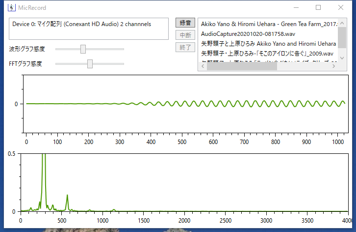

# AudioApp
## 音楽ファイルの再生、録音、スペクトラム表示

### 機能

音楽ファイル(MP3,FLAC)やデバイスからの入出力など6つの機能を選択できる。
音楽ファイルの再生や解析、デバイスからの取り込みには ライブラリとしてNAudioとNAudioFlacを使用している。
また音楽ファイルの再生にはMediaPlayerも利用している。  
ソフトの[概要](Document/AudioAppManual.pdf)と音楽ファイル管理の[機能](Document/MusicExplorer.pdf)を参照方  

起動画面  

1.マイクテスト  
PC1のマイク入力から取り込んだデータの波形表示やファイル保存を行う。  
 

2.オーディオプレイヤー  
音楽ファイルの再生と波形表示を行う。  
  

3.スピーカ出力キャプチャ  
PCのスピーカ出力をキャプチャーし、波形表示やファイル保存を行う。  
  

4.音楽ファイル管理  
音楽ファイルを演奏者、アルバム、曲でリスト表示して管理する。音楽ファイルのタグデータやイメージデータを表示する。  
  

5.スペクトラム表示  
音楽ファイルの波形、スペクトラム、周波数特性表示と再生を行う。  
  

6.ミュージシャン検索  
Wikipedia のミュージシャン一覧リストを読み込んでリスト表示し、個々のミュージシャンの基本情報を取得して表示する。  
  

### ■履歴
2025/12/17 音楽ファイル管理:タグのイメージデータ保存を追加  
2025/11/27 音楽ファイル管理:アルバムのファイルサイズ追加、アルバムリストからの更新処理追加  
2025/08/24 音楽ファイル管理:ファイル検索の修正、FRACタグの修正  
2025/08/21 音楽ファイル管理:設定のカテゴリ選択にコンテキストメニューによる追加、削除、変更機能を追加  
2025/04/13 スピーカ出力キャプチャ:MP3ファイルの同時出力を辞めてWAVからMP#変換を追加  
2025/03/20 音楽ファイル管理:アルバム単位で音楽ファイルをコピーするエクスポート機能追加  
2025/03/17 音楽ファイル管理:アルバム非表示機能追加,システム設定ボタン追加  
2025/02/06 音楽ファイル管理:曲データ消去で時間がかかるのを改善  
2024/04/13 音楽ファイル管理:イメージ表示に曲コメント表示追加  
2024/04/13 スピーカ出力キャプチャ:キー操作の追加と以上ファイル名の対応を追加  
2024/03/27 音楽ファイル管理:大文字小文字による重複ファイルの登録削除  
2023/09/21 音楽ファイル管理:タグイメージの複数ページ表示追加  
2023/04/07 音楽ファイル管理:音量バランスを追加  
2023/02/23 音楽ファイル管理:一覧データの読込・更新の時間を改善  
2022/09/16 音楽ファイル管理:起動速度改善  
2022/03/25 登録  

### ■実行環境
[AudioApp.zip](AudioApp.zip)をダウンロードして適当なフォルダに展開し、フォルダ内の AudioApp.exe をダブルクリックして実行します。  

### ■開発環境  
開発ソフト : Microsoft Visual Studio 2022  
開発言語　 : C# 7.3 Windows アプリケーション  
フレームワーク　 :  .NET framework 4.7.2  
NuGetライブラリ　: NAudio(1.10.0),NAudio.Flac(1.0.5702.29018),NAudio.Wma(1.0.1),
                   MathNet.Numerics(4.12.0),
                   OxyPlot.Core(2.0.0),OxyPlot.Wpf(2.0.0)  
自作ライブラリ   : WpfLib,AudioLib